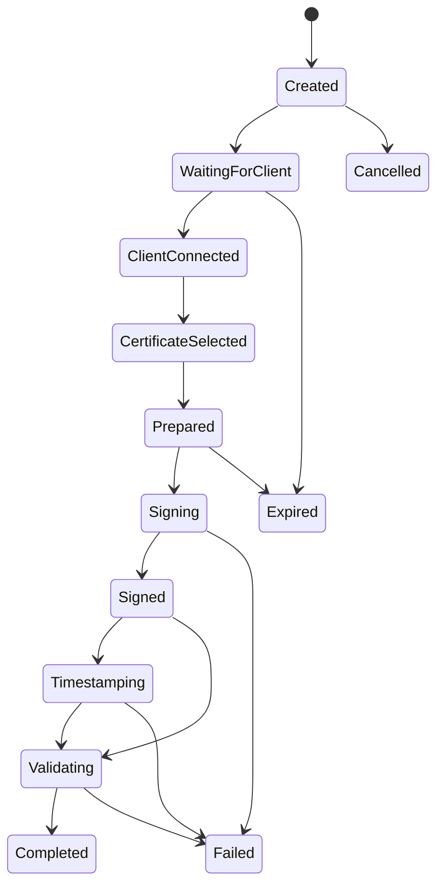

# API ve İş Akışları

MVP HTTP sözleşmesinin kaynak tanımı [openapi.yaml](openapi.yaml) dosyasıdır. Bu belge davranış ve karar gerekçelerini açıklar; şema çelişkisinde OpenAPI sözleşmesi esas alınır.

## 0. Normatif API gereksinimleri

- **API-001:** MVP HTTP sözleşmesi OpenAPI 3.1 ile tanımlanmalı ve sürüm kapısında doğrulanmalıdır.
- **API-002:** Kullanıcı akışı OAuth 2.1 Authorization Code + PKCE/OIDC; servis akışı client credentials veya mTLS ile korunmalıdır. Tenant/application kimliği token claim’lerinden türetilmelidir.
- **API-003:** Yan etkili bütün MVP uçları `Idempotency-Key` istemelidir; aynı anahtar + aynı canonical request hash önceki yanıtı, farklı hash `409 IMZAKIT.CORE.IDEMPOTENCY_CONFLICT` üretmelidir.
- **API-004:** Hatalar Problem Details ile ve dil bağımsız `code`, correlation, operation ve retry bilgisiyle dönmelidir.
- **API-005:** Her işlem durum makinesi guard’ı uygulamalı; geçersiz geçiş `409` üretmelidir.
- **API-006:** Agent sonuç callback’i mTLS istemci kimliği, operasyon bileti ve idempotency anahtarı gerektirmelidir.
- **API-007:** Büyük belgeler object reference ve süreli upload/download URL ile taşınmalı; Redis veya JSON içine gömülmemelidir.
- **API-008:** Her yanıt `X-Correlation-Id` taşımalı; istemci değeri güvenli biçimde kabul edilmeli veya sunucu tarafından üretilmelidir.
- **API-009:** Belge, gövde ve çağrı frekansı limitleri `413`/`429` ve makine-okunur hata kodları üretmelidir.
- **API-010:** `/v1` içinde geriye uyumsuz alan silme/tür değiştirme yapılamaz; genişletmeler additive olmalıdır.

## 1. API ilkeleri

- `/v1` ile sürümlenir; JSON alanları İngilizce ve kod dostu, dokümantasyon Türkçedir.
- Problem Details uyumlu hata gövdesi kullanılır.
- `X-Correlation-Id`, `Idempotency-Key` ve tenant/application context desteklenir.
- Binary belge için multipart küçük dosya, üretimde ise süreli object-storage upload/download önerilir.
- Operasyon kaynakları durum tabanlıdır; geçersiz state transition `409 Conflict` üretir.

## 2. Temel uçlar

| Yöntem | Uç | Amaç |
|---|---|---|
| POST | `/v1/signature-operations` | Operasyon ve belge referansı oluşturur |
| GET | `/v1/signature-operations/{id}` | Durum/sonuç özetini getirir |
| POST | `/v1/signature-operations/{id}/agent-ticket` | Tek kullanımlık Agent bileti üretir |
| POST | `/v1/signature-operations/{id}/certificate` | Seçilen sertifikayı operasyona bağlar |
| POST | `/v1/signature-operations/{id}/prepare` | DataToBeSigned üretir |
| POST | `/v1/signature-operations/{id}/complete` | SignatureValue ile formatı tamamlar |
| POST | `/v1/signature-operations/{id}/cancel` | Uygun durumdaki operasyonu iptal eder |
| POST | `/v1/validations` | Belge/imza doğrulaması başlatır |
| GET | `/v1/validations/{id}` | Ayrıntılı raporu getirir |
| POST | `/v1/signatures/extend` | B-B’den hedef baseline seviyesine uzatır |

## 3. Operasyon oluşturma örneği

```json
{
  "document": { "objectKey": "tenant-a/uploads/01...", "sha256": "..." },
  "format": "PAdES",
  "targetLevel": "B-T",
  "workflow": { "mode": "Single" },
  "appearance": { "page": 1, "x": 350, "y": 40, "width": 180, "height": 60 },
  "validationProfile": "TurkiyeNes"
}
```

Yanıt; `operationId`, `status`, `expiresAt`, `documentDigest` ve izin verilen sonraki eylemleri döndürür.

## 4. Durum makinesi



`Failed` teknik/iş kuralı hatasını; `Cancelled` yetkili iptali; `Expired` TTL dolmasını ifade eder. Retry edilebilir adımlar hata metadata’sında belirtilir. `Completed` terminaldir; yeni imza/uzatma yeni child operation oluşturur.

## 5. Prepare/complete bağlama

Prepare sonucu aşağıdakileri içerir:

- operasyon, belge ve revision kimliği
- belge hash’i ve `DataToBeSigned` hash’i
- ham `DataToBeSigned` (boyut sınırı içinde)
- hash/anahtar algoritması ile PKCS#11 mekanizma önerileri
- seçili sertifika parmak izi
- tek kullanımlık completion token ve süre

Complete; aynı operation, prepare version, sertifika ve digest bağını doğrular. Farklı sertifika, eski prepare sonucu veya değiştirilmiş belge reddedilir.

## 6. Hata modeli

```json
{
  "type": "https://docs.imzakit.dev/errors/pkcs11-pin-incorrect",
  "title": "PIN doğrulanamadı",
  "status": 422,
  "code": "IMZAKIT.PKCS11.PIN_INCORRECT",
  "detail": "Kart sağlayıcısı PIN'i reddetti.",
  "correlationId": "...",
  "operationId": "...",
  "retryable": true,
  "metadata": { "remainingAttemptsKnown": false }
}
```

Kod aileleri: `CORE`, `DOCUMENT`, `PDF`, `CMS`, `XADES`, `ASIC`, `PKCS11`, `TIMESTAMP`, `CERTIFICATE`, `TRUST`, `REVOCATION`, `VALIDATION`, `AGENT`, `WORKFLOW`, `STORAGE`.

HTTP eşlemesi: doğrulama/iş kuralı `422`, geçersiz state/idempotency çakışması `409`, kimlik `401`, yetki `403`, bulunamama `404`, limit `413/429`, dış bağımlılık `502/503/504`.

## 7. Seri ve paralel akış

Seri akış her tamamlanan imzadan sonra yeni kaynak revision üretir. Paralel akışta tüm katılımcılar aynı onaylanmış içerik hash’ine bağlanır; CAdES/ASiC çoklu signer birleştirmesi ile PAdES sequential revision semantiği ayrı stratejilerdir. Orkestratör bu farkı saklamaz; raporda her imzacının onayladığı digest/revision gösterilir.

## 8. Kimlik ve tenant bağlama

`tenantId` ve `applicationId` request gövdesinden yetki kaynağı olarak alınmaz. API bu değerleri doğrulanmış token veya mTLS cihaz kaydından türetir. Kullanıcı bağlamlı istemciler Authorization Code + PKCE/OIDC; servis istemcileri client credentials veya mTLS kullanır.

## 9. Idempotency davranışı

| Durum | Sonuç |
|---|---|
| Yeni anahtar | İşlem yürütülür; canonical request hash ve yanıt saklanır |
| Aynı anahtar + aynı hash | İlk işlemin status/body/header sonucu döner |
| Aynı anahtar + farklı hash | `409 IMZAKIT.CORE.IDEMPOTENCY_CONFLICT` |
| Süresi dolmuş kayıt | Anahtar yeni kabul edilebilir; audit önceki süre sonunu kaydeder |

Yan etkili operasyon oluşturma, Agent bileti, sertifika bağlama, prepare, complete, cancel, validation oluşturma ve Agent callback uçlarında `Idempotency-Key` zorunludur.

## 10. Uç ve durum geçişleri

| Uç | İzin verilen başlangıç | Başarılı sonuç |
|---|---|---|
| Operasyon oluştur | — | `Created` |
| Agent bileti | `Created`, `WaitingForClient` | `WaitingForClient` |
| Sertifika bağla | `ClientConnected`, `WaitingForClient` | `CertificateSelected` |
| Prepare | `CertificateSelected` | `Prepared` |
| Complete | `Prepared`, `Signing` | `Signed` veya `Validating` |
| Cancel | `Created`, `WaitingForClient`, `ClientConnected`, `CertificateSelected`, `Prepared` | `Cancelled` |
| Agent callback | `Prepared`, `Signing` | `Signed` |
| Validation oluştur | — | Ayrı validation kaynağı |

`/v1/signatures/extend` Faz 2 sözleşmesidir ve MVP OpenAPI paths listesinde bulunmaz.
