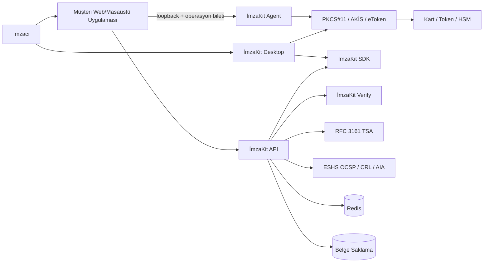
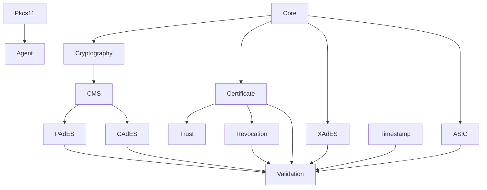
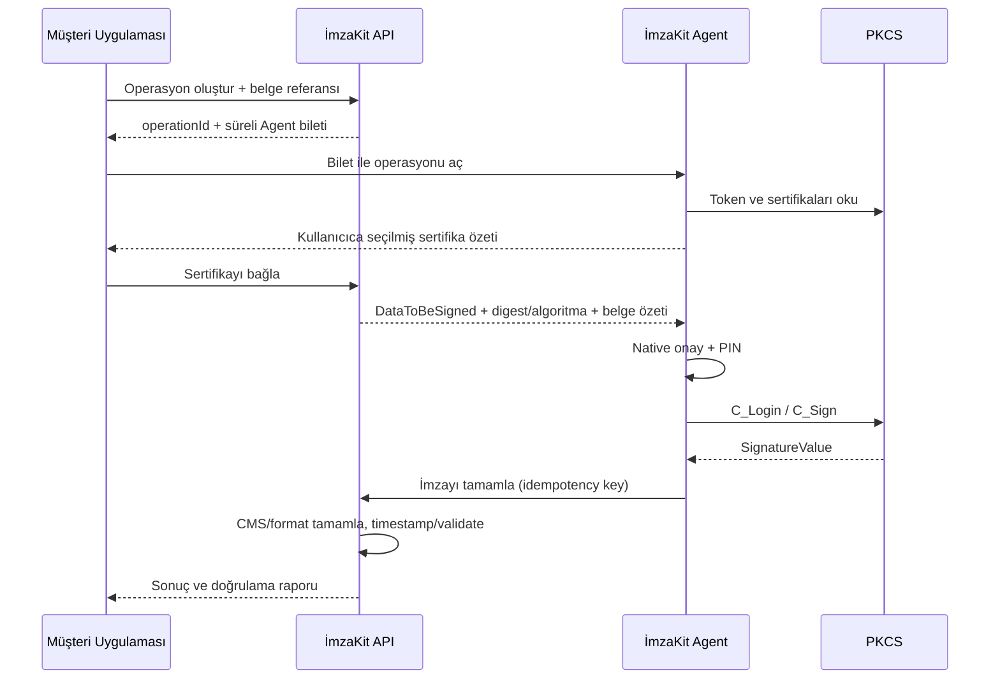

# Sistem Mimarisi

## 1. Bağlam



İmzaKit Desktop birinci taraf WinUI host’tur; süreç içinde SDK ve PKCS#11 kullanır. Agent ve API bu yolda zorunlu değildir ([ADR-008](../kararlar/ADR-008-winui-masaustu-imza-istemcisi.md)). Müşteri web/masaüstü uygulaması mevcut bilet + Agent akışını kullanmaya devam eder.

## 2. Modül sınırları

```text
ImzaKit.Core
ImzaKit.Cryptography
ImzaKit.Cms
ImzaKit.Certificate
ImzaKit.Trust
ImzaKit.Revocation
ImzaKit.Timestamp
ImzaKit.Validation
ImzaKit.Pkcs11
ImzaKit.PAdES
ImzaKit.CAdES
ImzaKit.XAdES
ImzaKit.ASiC
ImzaKit.Agent
ImzaKit.Api
ImzaKit.AspNetCore
ImzaKit.DependencyInjection
```

- `Core`: format ve sağlayıcıdan bağımsız domain modelleri, sonuçlar ve politikalar.
- `Cryptography`: hash ve algoritma eşlemesi; primitive implement etmez.
- `Cms`: ASN.1/CMS SignedData, SignerInfo, signed/unsigned attributes ve doğrulama.
- `Certificate`: X.509 parse, zincir kurma ve zincir doğrulama.
- `Trust`: sürümlü güven çapaları ve ESHS/politika kataloğu.
- `Revocation`: OCSP/CRL discovery, alma, cache, kriptografik doğrulama ve freshness.
- `Timestamp`: RFC 3161 request/response ve TSA doğrulaması.
- `Validation`: format doğrulayıcılarını ve güven politikasını orkestre eder.
- Format modülleri: imzalanacak byte dizisini hazırlar ve sonuç paketini tamamlar.
- `Pkcs11`: kart/token/HSM ayrıntılarını Agent ve Desktop dışında gizler.

## 3. Bağımlılık ilkesi



Formatlar PKCS#11, PIN, slot veya vendor DLL’i bilmez. CMS de PDF’i bilmez. Ortak `DogrulamaMalzemesi` modeli sertifikaları, OCSP cevaplarını ve CRL’leri taşır; her format bu kanıtı kendi standardına göre gömer.

## 4. İmzalama akışı



Desktop host aynı PKCS#11 ve PAdES prepare/complete adımlarını süreç içinde çalıştırır; operasyon bileti ve Agent callback yoktur. PIN CredUI native diyaloğundadır.

## 5. PAdES üretim modeli

- B-B: PDF incremental revision, `/ByteRange`, `/Contents`, detached CMS ve `/SubFilter /ETSI.CAdES.detached`.
- B-T: `SignatureValue` hash’i üzerinden RFC 3161 signature timestamp; CMS unsigned attribute.
- B-LT: imzacı ve TSA zincirleri ile OCSP/CRL kanıtlarının PDF DSS içine eklenmesi; VRI interoperabilite için desteklenir fakat doğrulama yalnız VRI’a bağlı değildir.
- B-LTA: `/Type /DocTimeStamp` ve `/SubFilter /ETSI.RFC3161` ile revision’ın korunması. Uzun dönem koruma yeni revision/timestamp eklenebilen yaşam döngüsüdür.

## 6. CMS modeli

PAdES ve CAdES aynı CMS çekirdeğini kullanır. Detached `SignedData` içinde `SignerInfo`, `issuerAndSerialNumber`, SHA-256 digest, `contentType`, `messageDigest` ve `signingCertificateV2/ESSCertIDv2` zorunlu başlangıç setidir. `signedAttrs` canonical DER olarak kodlanır ve kartın imzaladığı veri bu DER byte dizisidir; PDF digest’i doğrudan imzalanmaz.

## 7. Veri saklama

| Veri | Yer | İlke |
|---|---|---|
| Operasyon durumu, nonce, idempotency ve kısa metadata | Redis | TTL zorunlu; büyük binary yasak |
| Kaynak/sonuç belge | Nesne/belge saklama | Şifreli, tenant ayrımlı, süreli erişim |
| Trust Store ve politika paketleri | Sürümlü konfigürasyon deposu | Paket imzası doğrulanır |
| Audit olayları | Değiştirilemez log/SIEM | PIN, anahtar, ham belge ve credential içermez |

Belge saklama için `IBelgeDeposu` soyutlaması; object key, hash, içerik türü, boyut ve saklama süresi döndürür. API payload’larında büyük belgeler yerine süreli yükleme/indirme bağlantıları tercih edilir.

## 8. Dağıtım topolojisi

- SDK: uygulama içine gömülü NuGet paketleri.
- Agent: kod imzalı Windows installer, kontrollü auto-update ve rollback.
- Desktop: kod imzalı WinUI `setup.exe`; GitHub Releases; NuGet ve `site/` ikilisi yok ([ADR-008](../kararlar/ADR-008-winui-masaustu-imza-istemcisi.md)).
- API/Verify: stateless servisler; Redis ve belge deposuyla yatay ölçeklenir.
- Ağ erişimi: TSA, OCSP, CRL ve AIA için merkezi, kısıtlı `IExternalResourceFetcher`.

## 9. Kabul edilmiş çalışma zamanı kararları

- `ImzaKit.PAdES`, PDF motoruna bir adaptör sınırı üzerinden bağlanır; motor [ADR-005](../kararlar/ADR-005-pdf-motoru-secim-kapisi.md) kapısıyla seçilir.
- Agent yalnız loopback HTTP dinler. Ed25519 imzalı operasyon bileti 120 saniye geçerli ve tek kullanımlıktır; native onay zorunludur.
- Agent callback’i mTLS kullanır. Private key Agent içinde üretilir; enrollment sertifikası en fazla 30 gün geçerlidir, ömrünün üçte ikisinde yenilenir ve iptal edilebilir.
- Türkiye Trust Store ayrı, imzalı ve atomik güncellenen bir paket deposudur.
- Tamamlanmamış operasyon metadata’sı 24 saat; tamamlanan çıktı ve doğrulama raporu 7 gün saklanır. Redis ham belge tutmaz.
- Audit append-only yazılır ve her olay önceki olay hash’ini bağlar.
- İmzaKit Desktop süreç içi PAdES B-B üretir; PIN CredUI’dedir; Agent bileti yoktur ([ADR-008](../kararlar/ADR-008-winui-masaustu-imza-istemcisi.md)).
